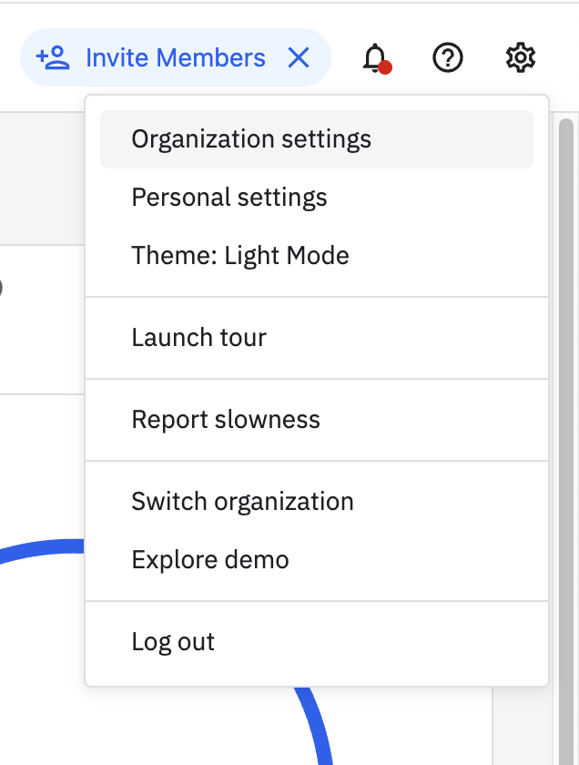
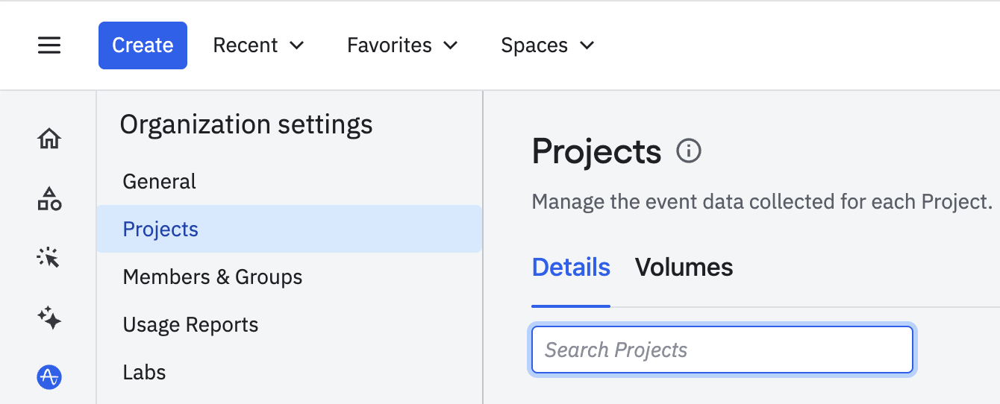
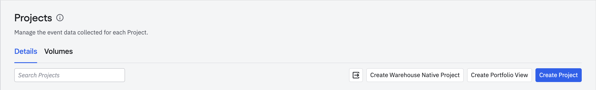
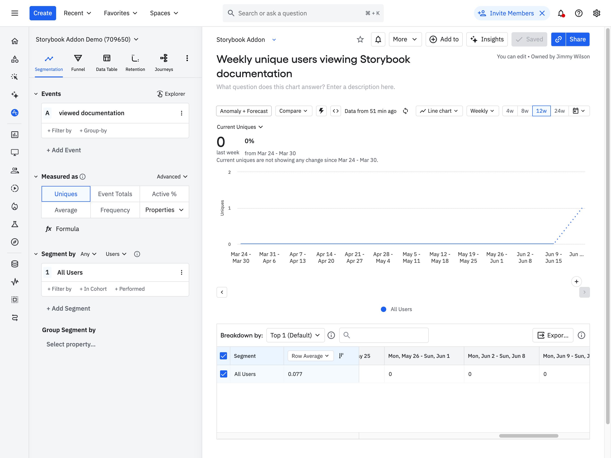
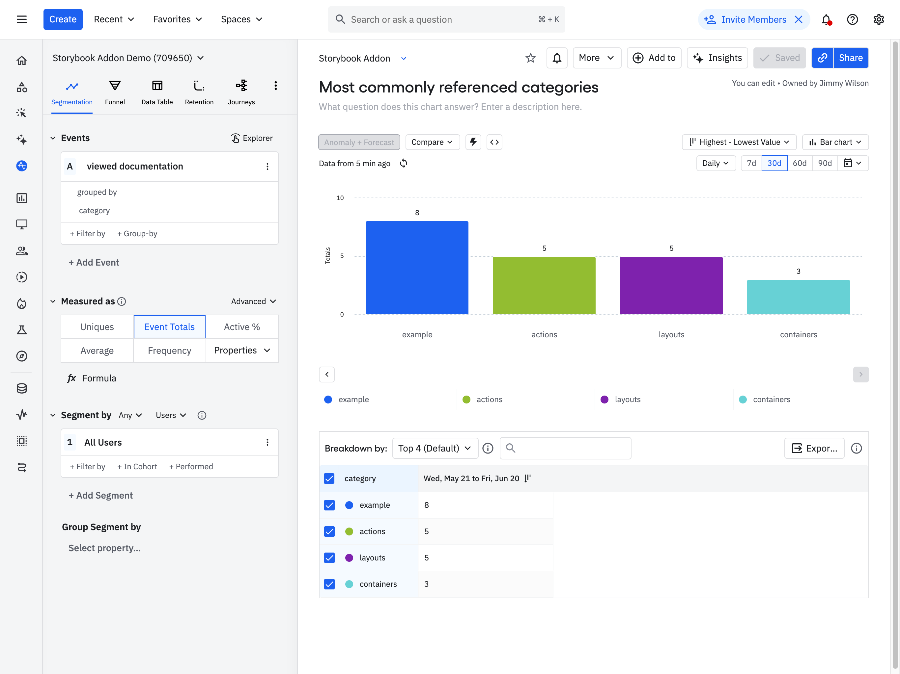
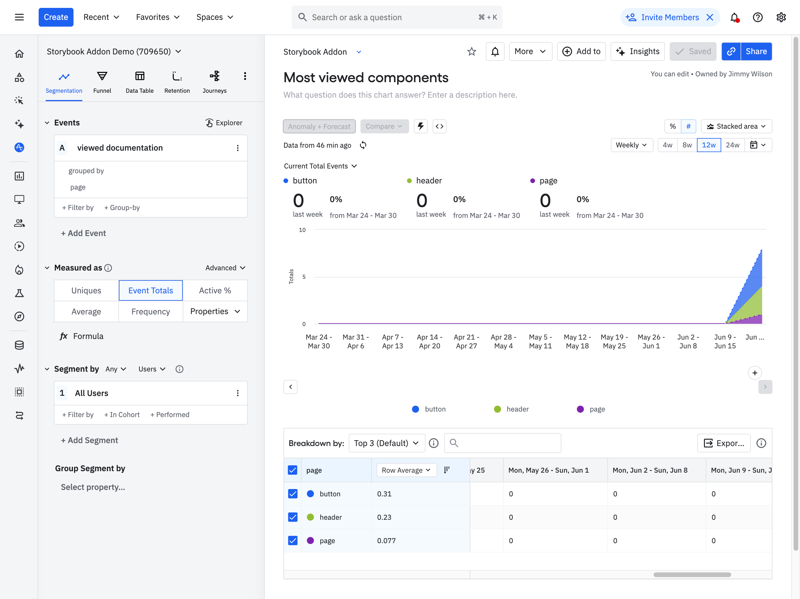
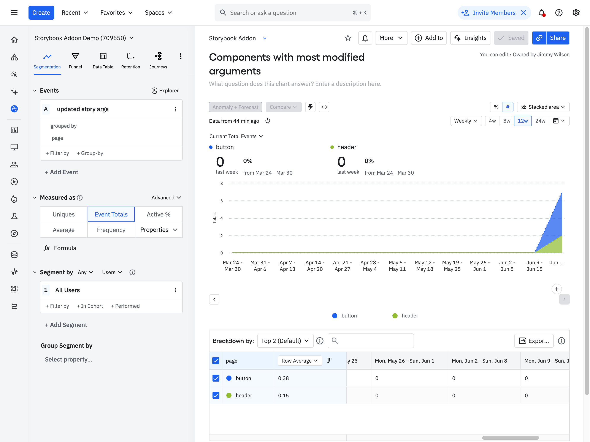

# storybook-addon-amplitude

A Storybook addon to capture events in [Amplitude](https://amplitude.com/).

[![version][version-badge]][package] [![MIT License][license-badge]][license] [![Auto Release][auto-badge]][auto] [![PRs Welcome][prs-badge]][issues] [](#contributors)

Read the [blog post here](https://amplitude.engineering/product-analytics-for-storybook-introducing-the-amplitude-storybook-add-on-e8857fb8168a).

## Prerequisites

- Node.js 20 or higher
- Storybook 9.0 or higher
- An Amplitude account (free tier available)

## Version Compatibility

| Storybook Version | Addon Version |
| ----------------- | ------------- |
| 9.x               | 3.x           |
| 8.x               | >= 2.1.0      |
| 7.x               | 2.0.0-2.0.1   |
| 6.x               | 1.x           |

## What does it do?

The Amplitude Storybook addon emits events to Amplitude on two different occasions: when a user navigates to a new page and when a user changes a story's args.

## Getting Started

The first thing you'll need to do is sign up for Amplitude. If you already have an account, great! If you don't, you can [sign up here for free](https://amplitude.com/get-started).

Once you have an account, you can create a new project which will have an associated API key.

_Note: You may want to create both a prod project and a dev project so you can test without influencing your data_

To do this, navigate to the Settings page.



Then, select Projects in the sidebar.



In the top right-hand corner, click the Create Project button and follow the instructions.



Next, install the package as a devDependency in your project:

```console
# Using yarn
yarn add @amplitude/storybook-addon-amplitude --dev

# Using npm
npm install @amplitude/storybook-addon-amplitude --save-dev
```

in `storybook/main.js`

```diff
module.exports: {
  addons: [
+   '@amplitude/storybook-addon-amplitude',
  ]
}
```

Then, set your Amplitude API keys in `./storybook/manager.js`

```ts
window.AMPLITUDE_DEV_API_KEY = "<amplitude-dev-api-key>";
window.AMPLITUDE_PROD_API_KEY = "<amplitude-prod-api-key>";
```

If you want to post to the EU endpoint make sure to set the `serverUrl` option:

```ts
window.AMPLITUDE_OPTIONS = {
  serverUrl: "https://api.eu.amplitude.com/2/httpapi",
};
```

> Read more: [Configurations](https://amplitude.com/docs/sdks/analytics/browser/browser-sdk-2#configure-the-sdk), [Endpoints](https://www.docs.developers.amplitude.com/analytics/apis/http-v2-api/#endpoints)

If you are in a TypeScript project you might want to add the following declarations:

```ts
declare global {
  interface Window {
    AMPLITUDE_DEV_API_KEY: string;
    AMPLITUDE_PROD_API_KEY: string;
    AMPLITUDE_OPTIONS: {
      serverUrl?: string;
    };
  }
}
```

Now your Storybook will begin emitting events to your project in Amplitude. You're ready to start creating charts in Amplitude!

## Example Charts

**Weekly unique users viewing Storybook documentation**



**Most commonly referenced categories**



**Most viewed components**



**Components with most modified arguments**



## Event Taxonomy

### User navigates to a new page

When a user switches to a new page, this addon emits an event to Amplitude that looks like this:

```
{
  event_type: "viewed documentation",
  event_properties: {
    category: "actions",
    page: "button"
  }
}
```

Tracking the event in this way allows you to build charts in Amplitude to show:

1. How many people have viewed your Storybook over time
2. What categories people are viewing most frequently
3. What pages people are viewing most frequently

### User changes a story's args

When a user changes a story's args, this addon emits an event that looks like this:

```
{
  event_type: "updated story args",
  event_properties: {
    category: "actions",
    page: "button"
  }
}
```

Tracking the event in this way allows you to build charts in Amplitude to answer:

1. How often do people use the story args functionality?
2. In which category of pages people update the story args most frequently?
3. On which pages people update the story args most frequently?

## Troubleshooting

### Events not showing up in Amplitude?

- Verify your API keys are correctly set in `storybook/manager.ts`
- Set `window.AMPLITUDE_OPTIONS = { logLevel: 4 };` in `storybook/manager.ts` and check your browser's console for any error messages
- Ensure you're using the correct server URL for your region

### Storybook not loading?

- Make sure the addon is properly installed and configured in `storybook/main.ts`
- Check that your Storybook version is compatible (9.0 or higher)

## Contributing

We are always happy to receive contributions! Please [refer to our CONTRIBUTING guidelines](CONTRIBUTING) for more details.

## License

This project is licensed under the MIT License - see the [LICENSE](LICENSE) file for details.

## Credits

**Owner:** [Amplitude Inc](https://github.com/amplitude)

**Current Maintainer:** [Jimmy Wilson (@jimmynotjim)](https://github.com/jimmynotjim)

**Contributors:**

<!-- ALL-CONTRIBUTORS-LIST:START - Do not remove or modify this section -->
<!-- prettier-ignore-start -->
<!-- markdownlint-disable -->
<table>
  <tr>
    <td align="center"><a href="https://github.com/jimmynotjim"><br /><sub><b>Jimmy Wilson</b></sub></a><br /><a href="https://github.com/jimmynotjim/@amplitude/storybook-addon-amplitude/issues?q=author%3Ajimmynotjim" title="Bug reports">🐛</a> <a href="https://github.com/jimmynotjim/@amplitude/storybook-addon-amplitude/commits?author=jimmynotjim" title="Code">💻</a> <a href="https://github.com/jimmynotjim/@amplitude/storybook-addon-amplitude/commits?author=jimmynotjim" title="Documentation">📖</a> <a href="#example-jimmynotjim" title="Examples">💡</a> <a href="#infra-jimmynotjim" title="Infrastructure (Hosting, Build-Tools, etc)">🚇</a> <a href="https://github.com/jimmynotjim/@amplitude/storybook-addon-amplitude/pulls?q=is%3Apr+reviewed-by%3Ajimmynotjim" title="Reviewed Pull Requests">👀</a> <a href="https://github.com/jimmynotjim/@amplitude/storybook-addon-amplitude/commits?author=jimmynotjim" title="Tests">⚠️</a> <a href="#tool-jimmynotjim" title="Tools">🔧</a></td>
    <td align="center"><a href="https://github.com/maecapozzi"><br /><sub><b>Mae Capozzi</b></sub></a><br /><a href="https://github.com/jimmynotjim/@amplitude/storybook-addon-amplitude/issues?q=author%3Amaecapozzi" title="Bug reports">🐛</a> <a href="https://github.com/jimmynotjim/@amplitude/storybook-addon-amplitude/commits?author=maecapozzi" title="Code">💻</a> <a href="https://github.com/jimmynotjim/@amplitude/storybook-addon-amplitude/commits?author=maecapozzi" title="Documentation">📖</a> <a href="#example-maecapozzi" title="Examples">💡</a> <a href="#infra-maecapozzi" title="Infrastructure (Hosting, Build-Tools, etc)">🚇</a> <a href="https://github.com/jimmynotjim/@amplitude/storybook-addon-amplitude/pulls?q=is%3Apr+reviewed-by%3Amaecapozzi" title="Reviewed Pull Requests">👀</a> <a href="https://github.com/jimmynotjim/@amplitude/storybook-addon-amplitude/commits?author=maecapozzi" title="Tests">⚠️</a> <a href="#tool-maecapozzi" title="Tools">🔧</a></td>
    <td align="center"><a href="https://github.com/jackmccloy"><br /><sub><b>Jack McCloy</b></sub></a><br /><a href="https://github.com/jimmynotjim/@amplitude/storybook-addon-amplitude/commits?author=jackmccloy" title="Code">💻</a> <a href="#infra-jackmccloy" title="Infrastructure (Hosting, Build-Tools, etc)">🚇</a> <a href="https://github.com/jimmynotjim/@amplitude/storybook-addon-amplitude/pulls?q=is%3Apr+reviewed-by%3Ajackmccloy" title="Reviewed Pull Requests">👀</a></td>
    <td align="center"><a href="https://github.com/tijmenvangurp"><br /><sub><b>Tijmen van Gurp</b></sub></a><br /><a href="https://github.com/jimmynotjim/@amplitude/storybook-addon-amplitude/commits?author=tijmenvangurp" title="Code">💻</a></td>
    <td align="center"><a href="https://github.com/kaelig"><br /><sub><b>Kaelig Deloumeau-Prigent</b></sub></a><br /><a href="https://github.com/jimmynotjim/@amplitude/storybook-addon-amplitude/commits?author=kaelig" title="Code">💻</a></td>
    <td align="center"><a href="https://github.com/smitev"><br /><sub><b>Slave Mitev</b></sub></a><br /><a href="https://github.com/jimmynotjim/@amplitude/storybook-addon-amplitude/commits?author=smitev" title="Code">💻</a> <a href="https://github.com/jimmynotjim/@amplitude/storybook-addon-amplitude/commits?author=smitev" title="Documentation">📖</a> <a href="#example-smitev" title="Examples">💡</a> <a href="#infra-smitev" title="Infrastructure (Hosting, Build-Tools, etc)">🚇</a></td>
    <td align="center"><a href="https://github.com/bsoe003"><br /><sub><b>Brian Soe</b></sub></a><br /><a href="https://github.com/jimmynotjim/@amplitude/storybook-addon-amplitude/pulls?q=is%3Apr+reviewed-by%3Absoe003" title="Reviewed Pull Requests">👀</a></td>
  </tr>
  <tr>
    <td align="center"><a href="https://github.com/vuamp"><br /><sub><b>Vu Nguyen</b></sub></a><br /><a href="https://github.com/jimmynotjim/@amplitude/storybook-addon-amplitude/pulls?q=is%3Apr+reviewed-by%3Avuamp" title="Reviewed Pull Requests">👀</a></td>
  </tr>
</table>

<!-- markdownlint-restore -->
<!-- prettier-ignore-end -->

<!-- ALL-CONTRIBUTORS-LIST:END -->

This project follows the [all-contributors](https://github.com/all-contributors/all-contributors) specification. Contributions of any kind welcome!

[package]: https://www.npmjs.com/package/@amplitude/storybook-addon-amplitude
[version-badge]: https://img.shields.io/npm/v/@amplitude/storybook-addon-amplitude.svg?style=flat
[license-badge]: https://img.shields.io/badge/license-MIT-blue.svg?style=flat
[license]: https://github.com/amplitude/storybook-addon-amplitude/blob/main/LICENSE
[prs-badge]: https://img.shields.io/badge/PRs-welcome-brightgreen.svg?style=flat
[issues]: https://github.com/amplitude/storybook-addon-amplitude/issues?q=archived:false+is:issue+is:open+sort:updated-desc+label%3A%22help%20wanted%22%2C%22good%20first%20issue%22
[auto-badge]: https://img.shields.io/badge/release-auto.svg?colorA=888888&colorB=9B065A&label=auto
[auto]: https://github.com/intuit/auto
